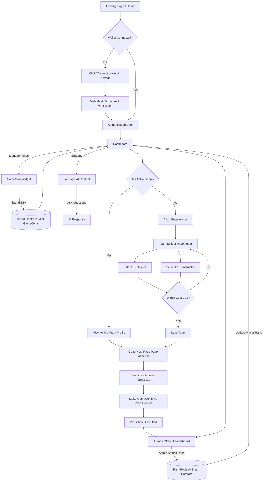

# LapLogic Frontend User Flow

This document outlines the user journey and interactions across the LapLogic frontend based on the current application structure.

## User Experience (UX) Narrative

LapLogic offers a highly immersive, dark-themed interface inspired by modern F1 telemetry screens and racing aesthetics. The experience is designed to feel high-speed, tactical, and rewarding.

### 1. Seamless Web3 Onboarding
**What the user feels:** No usernames or passwords to manage. The user simply connects their Web3 wallet (e.g., MetaMask) and signs a message. It feels secure and modern, instantly placing them in the driver's seat. 
**Under the hood:** `WalletContext.tsx` handles the Ethereum provider, requests a signature, and verifies it with the backend to establish a secure session block.

### 2. The Pit Wall (Dashboard Hub)
**What the user feels:** Arriving at the Dashboard, the user is greeted by a dense, 4-panel telemetry display. They see their "Driver Profile" (rank, points, active team). A dynamically animated spinning Pirelli tire tempts them to "Enter the Arena." To their right, premium upcoming Grand Prix details are laid out, and an AI Pit Wall Chatbot is ready to crunch F1 strategy numbers.
**Under the hood:** The `/dashboard` acts as the central router, pulling user state, upcoming race data from the backend, and hooking into the LapLogic AI (`/api/chat`).

### 3. Tactile Smart Contract Economy
**What the user feels:** Managing funds feels authentic. The GameCoin Widget displays their true on-chain GC balance. When they click "Buy GameCoins," MetaMask pops up, requiring an explicit blockchain confirmation. Upon success, their balance updates seamlessly without a page reload.
**Under the hood:** React components call `ethers.ts` functions (`purchaseGameCoins`, `getOnChainBalance`), interacting directly with the locally deployed `GameCoin.sol` via Web3 providers.

### 4. Strategic Team Building
**What the user feels:** The user steps into the shoes of an F1 Team Principal. They must balance a strict budget (Cost Cap) while selecting high-performing drivers and a constructor. The UI gives immediate, interactive feedback as the budget bar fills up, turning team selection into a puzzle.
**Under the hood:** `/team` routing handles cost calculations, renders visual cards for drivers/teams, and verifies the roster against the backend validation logic.

### 5. High-Stakes Predictions & Leaderboards
**What the user feels:** With a team built and GameCoins in the bank, the user navigates to the next race. They stake their GameCoins on specific race outcomes. Once the race ends, the Global Leaderboard updates, and they can watch their rank climb in real-time, accompanied by visual rank promotions.
**Under the hood:** Takes place in `/predict/[raceId]` and `/arena`. Predictions lock in tokens. When an admin settles the race, winning predictions trigger backend calls to `RankRegistry.sol`, ensuring the user's elevated rank is immutably stored on the blockchain.
