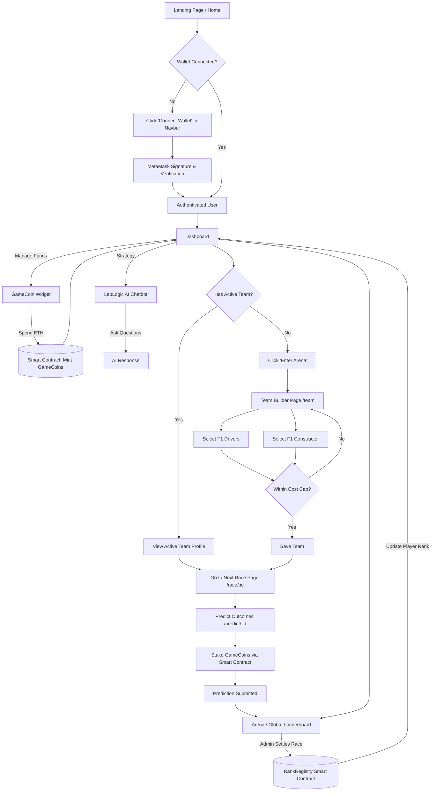

# LapLogic Frontend User Flow

This document outlines the user journey and interactions across the LapLogic frontend based on the current application structure.

## Key Modules Explained

1. **Authentication (`/context/WalletContext.tsx`, `AuthButton.tsx`)**: Replaces traditional email/password with Web3 wallet signatures (MetaMask).
2. **Dashboard (`/dashboard`)**: The central hub displaying the user's Driver Profile, Active Team, GameCoin Balance, Next Race details, and the LapLogic AI Chatbot.
3. **GameCoin Purchasing (`GameCoinWidget.tsx`, `lib/ethers.ts`)**: Integrates directly with the deployed `GameCoin.sol` contract locally, converting mock test ETH to in-game currency (GC).
4. **Team Builder (`/team`)**: Users build their optimal F1 fantasy lineup ensuring they stay under the specified cost cap.
5. **Predictions (`/predict/[raceId]`)**: Users put their GameCoins on the line based on their team setup and race expectations.
