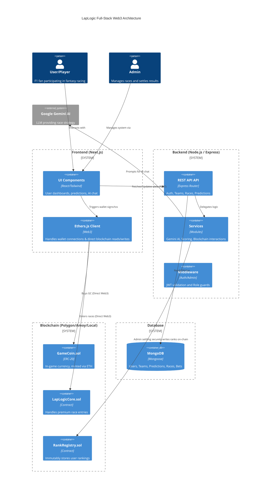

# LapLogic System Architecture

This document provides a high-level overview of the LapLogic system architecture, a full-stack Web3 application blending F1 fantasy sports with blockchain economics and AI strategy.

## Architecture Diagram

## System Components

### 1. Frontend (Next.js + Tailwind CSS)
The client-facing layer is optimized for a sleek, dark-mode racing aesthetic. 
- **Framework:** Next.js utilizing the App Router.
- **Styling:** Tailwind CSS for responsive, immersive 3D-styled UI elements.
- **Web3 Integration:** Uses `ethers.js` via a `WalletContext` to prompt MetaMask signatures for authentication and directly transact with smart contracts (like purchasing GameCoins).

### 2. Backend (Node.js + Express.js)
A robust API layer that handles the off-chain business logic and database interactions.
- **Authentication:** Wallet signature-based login. The backend verifies the cryptographic signature and issues a JWT.
- **Core Entities:** Manages Users, active Teams (Driver/Constructor constraints), Race schedules, and Prediction tracking.
- **AI Service:** Connects to Google's Gemini API to act as the "LapLogic AI Chatbot," acting as the user's strategic pit wall advisor.
- **Admin Settlement:** When an admin settles a race, the backend calculates scores, updates the database, and uses a secure admin private key to update user ranks immutably on the `RankRegistry` smart contract.

### 3. Smart Contracts (Solidity + Hardhat)
The decentralized layer dictating the game's economy and verifiable user achievements.
- **GameCoin (GC):** An ERC-20 token representing the in-game economy. Users can mint this token directly from the frontend using native ETH (or test ETH).
- **LapLogicCore:** Designed to handle paid race entries and logical smart contract interactions related to the game loop.
- **RankRegistry:** A secure, permissioned contract that stores the user's permanent F1 rank (e.g., Rookie, Pro, Legend) on-chain, creating verifiable bragging rights.

### 4. Database (MongoDB)
The central data store for all dynamic, non-financial game state.
- **Collections:** 
  - `Users` (Profile, off-chain balances, team refs)
  - `Teams` (Cost-cap validated rosters built by users)
  - `Races` (Circuit data, status like 'upcoming' or 'completed')
  - `Predictions` / `Bets` (User forecasts for specific races)

## Key Data Flows

- **Authentication Flow:** User clicks "Connect Wallet" -> Frontend requests MetaMask signature -> Signature sent to Backend -> Backend verifies signature via Ethers.js -> Backend returns JWT -> Frontend stores JWT and updates UI.
- **Economy Flow (GameCoin):** User clicks "Buy GameCoins" -> Frontend directly calls `GameCoin.mint()` on the blockchain via MetaMask -> Transaction is mined -> User's on-chain balance updates.
- **Settlement Flow (Rank Upgrade):** Race finishes -> Admin posts results to Backend -> Backend calculates user scores in MongoDB -> If a user thresholds into a new rank, Backend sends an administrative transaction to `RankRegistry.sol` -> Rank is permanently written to the blockchain.